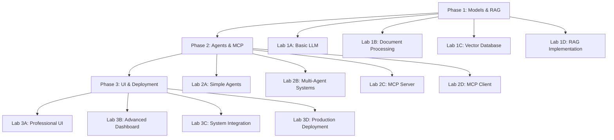

# AI Enterprise Accelerator Training - Lab Guides

> **Hands-on learning labs designed for 10-12 minute completion**  
> **Focus:** Practical implementation of core AI technologies

---

## 📋 Lab Overview

### **Total Duration:** ~2.25 hours
- **Phase 1:** Models & RAG Foundation (45 minutes)
- **Phase 2:** AI Agents & MCP Protocol (45 minutes)  
- **Phase 3:** Professional UI & Deployment (45 minutes)

### **Lab Philosophy**
- ⏱️ **Time-boxed:** Each lab 10-12 minutes maximum
- 🎯 **Focused:** One core concept per lab
- 💻 **Hands-on:** Minimal theory, maximum implementation
- 📋 **Copy-paste friendly:** Pre-written code snippets
- ✅ **Validation-driven:** Clear success criteria

---

## 🎓 Learning Path



---

## 📚 Phase 1: Models & RAG Foundation

**File:** [phase1_labs.md](./phase1_labs.md)

### **Learning Objectives**
- Connect to and configure LLMs (Ollama/llama3.2)
- Process documents for AI consumption
- Build semantic search with vector databases
- Implement complete RAG pipelines

### **Labs**
1. **Lab 1A: Basic LLM Integration** (12 min) - LLM connection and prompt engineering
2. **Lab 1B: Document Processing** (10 min) - PDF processing and text chunking
3. **Lab 1C: Vector Database Setup** (11 min) - ChromaDB and semantic search
4. **Lab 1D: RAG Implementation** (12 min) - Complete retrieval-augmented generation

### **Prerequisites**
```bash
# Required software
ollama pull llama3.2
pip install requests chromadb pypdf python-docx

# Verify setup
ollama list
```

---

## 🤖 Phase 2: AI Agents & MCP Protocol

**File:** [phase2_labs.md](./phase2_labs.md)

### **Learning Objectives**
- Build intelligent agents with tools and memory
- Implement multi-agent coordination workflows
- Create MCP servers exposing AI tools
- Integrate MCP clients with agent systems

### **Labs**
1. **Lab 2A: Simple Agent Logic** (11 min) - Tool-enabled agents with memory
2. **Lab 2B: Multi-Agent Coordination** (12 min) - RAG-enhanced agent workflows
3. **Lab 2C: MCP Server Implementation** (10 min) - Standards-compliant tool servers
4. **Lab 2D: MCP Client Integration** (12 min) - Multi-server agent connectivity

### **Prerequisites**
```bash
# Build on Phase 1 components
# Ensure RAG system is functional
# Verify document processing pipeline
```

---

## 🎨 Phase 3: Professional UI & Deployment

**File:** [phase3_labs.md](./phase3_labs.md)

### **Learning Objectives**
- Design professional enterprise-grade interfaces
- Implement real-time analytics dashboards
- Build admin controls and view management
- Deploy production-ready AI applications

### **Labs**
1. **Lab 3A: Professional UI Framework** (12 min) - Modern Streamlit interfaces
2. **Lab 3B: Advanced Dashboard Features** (11 min) - Analytics and admin controls
3. **Lab 3C: Complete System Integration** (12 min) - End-to-end platform assembly
4. **Lab 3D: Production Deployment** (10 min) - Docker, security, monitoring

### **Prerequisites**
```bash
# Build on Phase 1-2 components
pip install streamlit plotly pandas
# Ensure all previous phases functional
```

---

## 🚀 Quick Start Guide

### **1. Environment Setup** (5 minutes)
```bash
# Clone repository
git clone <repository-url>
cd capstone/training_phases

# Install dependencies
pip install -r requirements.txt

# Start Ollama
ollama pull llama3.2
ollama serve

# Verify setup
python phase1a_basic_llm.py --test
```

### **2. Choose Your Path**

#### **📚 Complete Training** (2.25 hours)
```bash
# Follow all labs sequentially
# Phase 1 → Phase 2 → Phase 3
# Build complete understanding
```

#### **⚡ Focused Learning** (45 minutes)
```bash
# Choose one phase based on interests:
# Phase 1: RAG and document processing
# Phase 2: AI agents and tool integration  
# Phase 3: Professional UI development
```

#### **🎯 Specific Skills** (10-12 minutes)
```bash
# Jump to specific labs:
# Lab 1D: RAG implementation
# Lab 2B: Multi-agent systems
# Lab 3C: Complete integration
```

---

## 🔧 Troubleshooting Guide

### **Common Issues**

| Issue | Solution | Phase |
|-------|----------|-------|
| Ollama connection failed | `ollama serve`, check port 11434 | 1 |
| ChromaDB permission error | Check write permissions in project directory | 1 |
| MCP server won't start | Verify Python path, check for port conflicts | 2 |
| Streamlit import error | `pip install streamlit plotly pandas` | 3 |
| Agent tools not working | Verify tool registration and descriptions | 2 |
| UI styling broken | Clear browser cache, check CSS imports | 3 |

### **Debug Commands**
```bash
# Test LLM connection
curl http://localhost:11434/api/generate -d '{"model":"llama3.2","prompt":"test"}'

# Check ChromaDB
python -c "import chromadb; print('ChromaDB OK')"

# Verify MCP server
python phase2c_mcp_server.py --test-connection

# Test Streamlit
streamlit hello
```

---

## 📊 Progress Tracking

### **Phase 1 Completion Checklist**
- [ ] Lab 1A: LLM responds in <3 seconds
- [ ] Lab 1B: Documents processed into chunks
- [ ] Lab 1C: Vector search returns relevant results (>0.7 similarity)
- [ ] Lab 1D: RAG provides factual answers with citations

### **Phase 2 Completion Checklist**
- [ ] Lab 2A: Agent uses tools and maintains memory
- [ ] Lab 2B: Multi-agent coordination works
- [ ] Lab 2C: MCP server exposes functional tools
- [ ] Lab 2D: MCP client integrates with agents

### **Phase 3 Completion Checklist**
- [ ] Lab 3A: Professional UI loads and functions
- [ ] Lab 3B: Analytics dashboard shows real-time data
- [ ] Lab 3C: Complete system integration working
- [ ] Lab 3D: Production deployment configuration ready

---

## 🎯 Learning Outcomes

Upon completion, participants will be able to:

### **Technical Skills**
- ✅ **Integrate LLMs** into applications with proper prompt engineering
- ✅ **Build RAG systems** for enterprise knowledge retrieval
- ✅ **Develop AI agents** with tools, memory, and coordination
- ✅ **Implement MCP protocol** for standardized AI tool communication
- ✅ **Create professional UIs** with modern frameworks and styling
- ✅ **Deploy AI applications** with proper security and monitoring

### **Architecture Understanding**
- ✅ **RAG Pipeline Design** - Document processing → Vector storage → Retrieval → Generation
- ✅ **Agent Coordination** - Multi-agent workflows and communication patterns
- ✅ **MCP Architecture** - Client-server tool communication standards
- ✅ **Production Deployment** - Containerization, monitoring, security best practices

### **Best Practices**
- ✅ **Prompt Engineering** - Effective LLM communication techniques
- ✅ **Vector Database Optimization** - Chunking strategies and similarity tuning
- ✅ **Agent Design Patterns** - Tool registration, memory management, coordination
- ✅ **UI/UX Principles** - Professional interface design and user experience
- ✅ **Security Implementation** - Input validation, rate limiting, audit logging

---

## 📞 Support & Resources

### **Getting Help**
- 🐛 **Technical Issues:** Check troubleshooting guide above
- 💡 **Concepts:** Review phase documentation and code comments
- 🔧 **Lab Problems:** Use provided code snippets and validation steps
- 🚀 **Advanced Topics:** Explore extension challenges in each lab

### **Additional Resources**
- 📖 **Phase Documentation:** Detailed explanations in each phase*.py file
- 🔗 **External Links:** 
  - [Ollama Documentation](https://ollama.ai/docs)
  - [ChromaDB Guide](https://docs.trychroma.com/)
  - [Streamlit Docs](https://docs.streamlit.io/)
  - [Model Context Protocol](https://modelcontextprotocol.io/)

### **Extension Activities**
- 🏗️ **Custom Tools:** Build domain-specific MCP tools
- 🎨 **UI Themes:** Create custom Streamlit themes
- 🤖 **Agent Types:** Develop specialized agent personalities
- 📊 **Analytics:** Add custom metrics and dashboards

---

**Ready to start? Choose your phase and begin building enterprise-grade AI applications!**